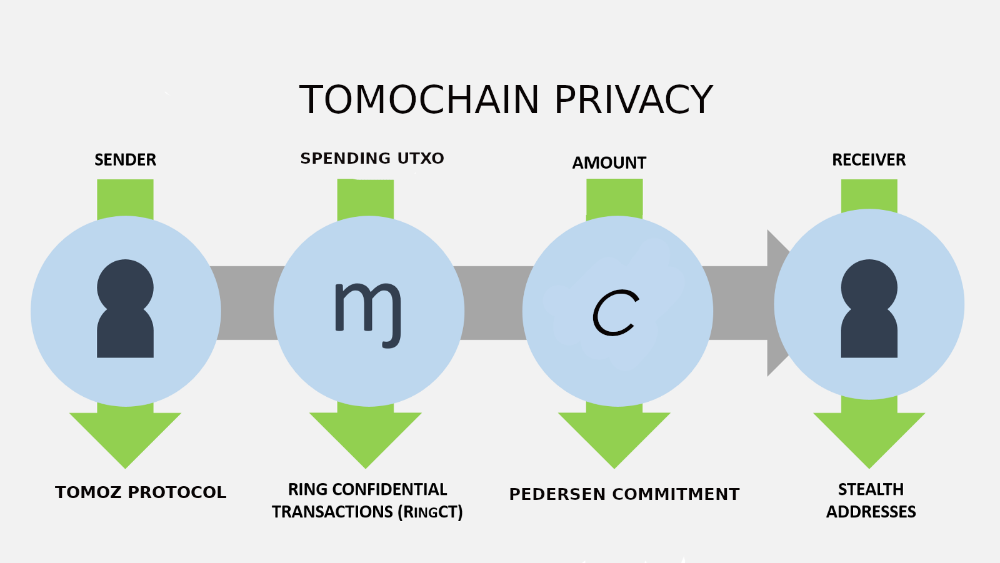

# Introduction Tomochain privacy
TomoChain offers native privacy support in the EVM core layer by providing a set of precompiled contracts for proven privacy techniques, including Ring Confidential Transaction, Bulletproofs, and Zksnarks. In the second layer, SDK, application-specific smart contracts, and a new private token standard will be provided for third-parties to issue private tokens on TomoChain and to build DApps with privacy support.

** Content **

* [Basic Terms](terms.md).
* [Protocol](protocol.md).
* [Libraries](libraries.md).
* [Roadmap](roadmap.md).

