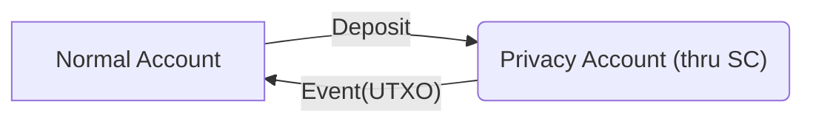
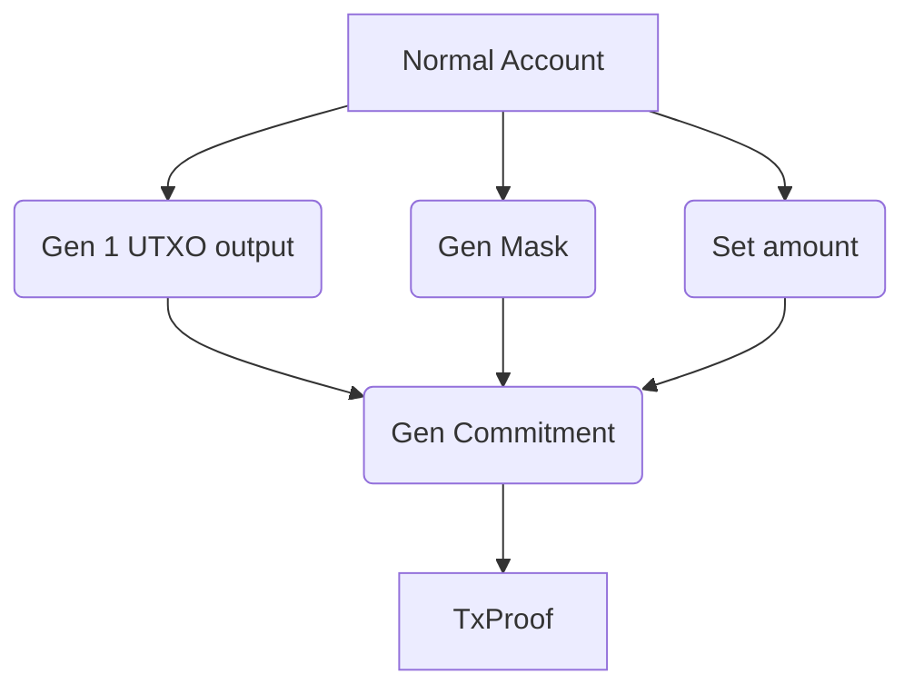
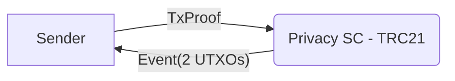
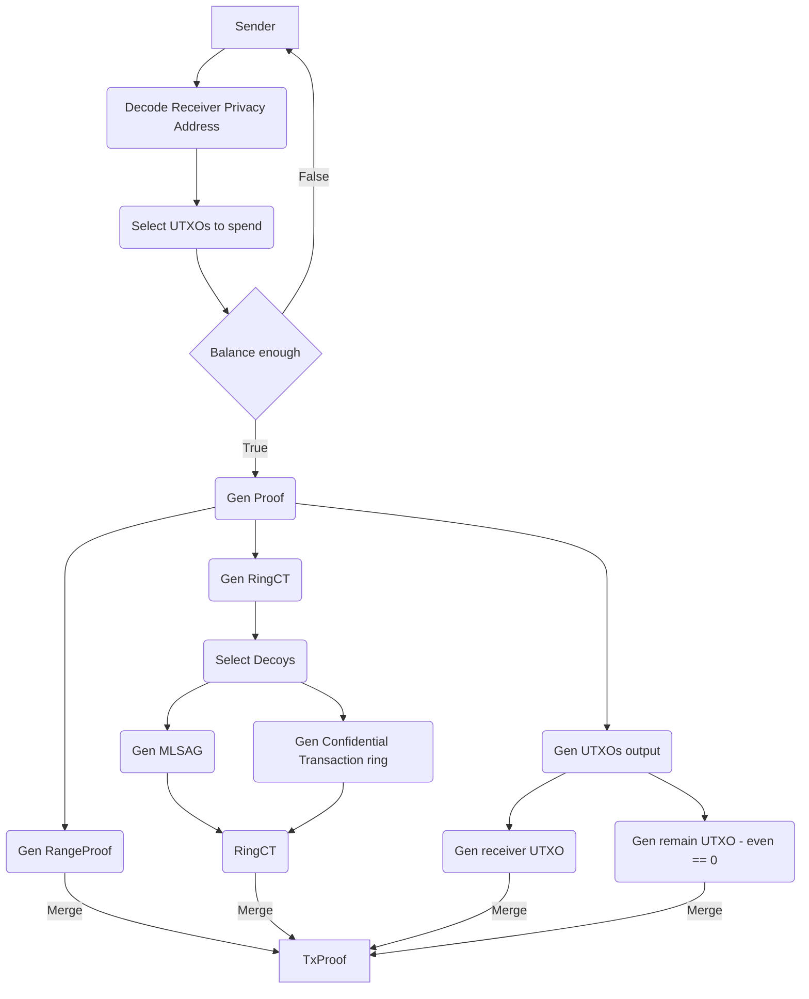

## General flow

*** [Deposit](#deposit) ***

To use privacy transaction, you need to deposit to your privacy account first - this process is visible to everyone, recorded on chain as
In transactions to smart-contract. The output of this progress is an UTXO

*** Generate Transaction Proof in Deposit ***

*** Private Send ***

How the TxProof generated is explained in detail below.

*** Generate Transaction Proof in Private Send ***

## Deposit

## UTXO data structure

